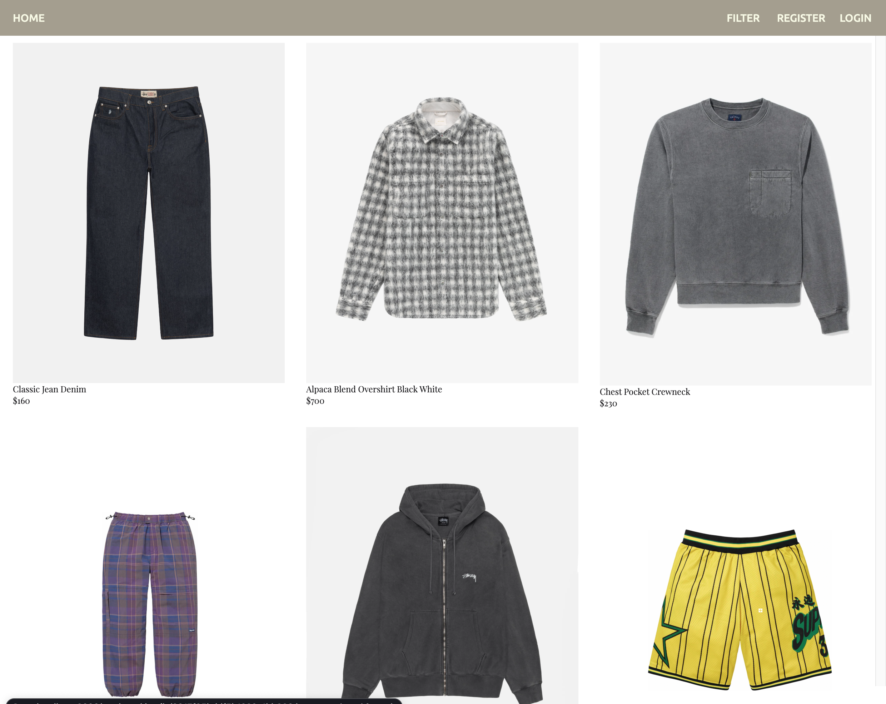

# Ecommerce Project

A full-stack ecommerce web application built with Node.js, Express, and MongoDB. Users can browse products, filter by brand and category, save favorites, and manage their account. An admin dashboard provides user management.



## Features

- Browse and filter products by brand and category
- Paginated product listing
- Product detail pages
- User registration and login with JWT authentication
- Favorite/unfavorite products
- Admin dashboard to view all users and their favorites
- Password hashing with Argon2

## Tech Stack

**Backend**
- [Node.js](https://nodejs.org/) + [Express](https://expressjs.com/)
- [MongoDB Atlas](https://www.mongodb.com/atlas) via [Mongoose](https://mongoosejs.com/)
- [JSON Web Tokens](https://jwt.io/) for authentication
- [Argon2](https://github.com/ranisalt/node-argon2) for password hashing
- [EJS](https://ejs.co/) for server-rendered product detail pages

**Frontend**
- Vanilla JavaScript
- [Font Awesome](https://fontawesome.com/) icons
- SASS/CSS

## Project Structure

```
├── api/
│   ├── middleware.js     # JWT validation, input validation
│   ├── mongoClient.js    # Frontend-side API helpers
│   └── mongoServer.js    # Business logic & MongoDB operations
├── models/
│   ├── Brand.js
│   ├── Product.js
│   ├── Type.js
│   └── User.js
├── routes/
│   └── users.js          # API route definitions
├── views/
│   ├── index.html        # Home / product listing page
│   ├── index.js
│   ├── login/
│   ├── register/
│   ├── products/         # Product detail page (EJS)
│   ├── admin/            # Admin dashboard
│   └── style/            # SASS source + compiled CSS
├── bin/www               # HTTP server entry point
├── app.js                # Express app setup
└── package.json
```

## Getting Started

### Prerequisites

- Node.js 18+
- A [MongoDB Atlas](https://www.mongodb.com/atlas) cluster (or local MongoDB instance)

### Installation

1. Clone the repository:
   ```bash
   git clone https://github.com/your-username/ecommerce-project.git
   cd ecommerce-project
   ```

2. Install dependencies:
   ```bash
   npm install
   ```

3. Create a `.env` file in the project root:
   ```env
   MONGO_URL="mongodb+srv://<username>:<password>@<cluster>.mongodb.net/<dbname>?retryWrites=true&w=majority"
   PORT=3000
   ACCESS_TOKEN_SECRET=<your-random-secret>
   ```

   Generate a secure `ACCESS_TOKEN_SECRET` with:
   ```bash
   node -e "console.log(require('crypto').randomBytes(64).toString('hex'))"
   ```

4. Start the server:
   ```bash
   # Production
   npm start

   # Development (auto-reload)
   npm run dev
   ```

5. Open [http://localhost:3000](http://localhost:3000) in your browser.

## API Endpoints

| Method | Endpoint | Auth | Description |
|--------|----------|------|-------------|
| POST | `/register` | — | Register a new user |
| POST | `/login` | — | Log in, returns JWT |
| GET | `/logout` | JWT | Clear auth cookie |
| GET | `/products` | — | List products (paginated, filterable) |
| GET | `/products/details/:id` | — | Product detail page |
| GET | `/products/image` | — | Get product image by ID |
| PUT | `/favorite` | JWT | Add product to favorites |
| DELETE | `/unfavorite` | JWT | Remove product from favorites |
| GET | `/favlist` | JWT | Get current user's favorites |
| GET | `/admin/user` | JWT (admin) | List all users |

### Query Parameters — `GET /products`

| Parameter | Type | Description |
|-----------|------|-------------|
| `page` | number | Page number (default: 1) |
| `brand` | string (repeatable) | Filter by brand name |
| `type` | string (repeatable) | Filter by category name |

## Authentication

Protected routes require a Bearer token in the `Authorization` header:
```
Authorization: Bearer <token>
```

Tokens are also stored in an `httpOnly` cookie and expire after 1 hour.

## Environment Variables

| Variable | Description |
|----------|-------------|
| `MONGO_URL` | MongoDB connection string |
| `PORT` | Server port (default: 3000) |
| `ACCESS_TOKEN_SECRET` | Secret key for signing JWTs |
